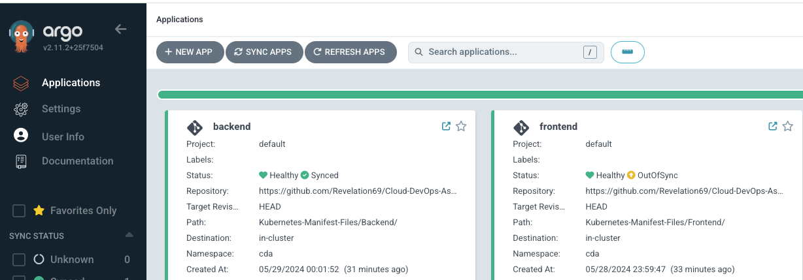

# Cloud-DevOps-Project

## Project Overview

This project aims to create a secure, highly available, and scalable infrastructure to host an application consisting of a Java backend and a .Net application frontend. The infrastructure setup is detailed in the architecture below, leveraging various AWS resources.


### Architecture Overview:

**AWS Cloud:**

VPC (Virtual Private Cloud): A virtual network dedicated to your AWS account, isolating your resources from others in the AWS cloud. It provides a private addressing scheme and security groups to control traffic flow.

Public and Private Subnets: Segmented parts of a VPC. Public subnets allow inbound traffic from the internet, while private subnets do not. This architecture uses two public subnets for load balancers and NAT gateways, and four private subnets for worker nodes and databases, ensuring that worker nodes and the database are not exposed to the internet directly.

Availability Zones: Distinct locations within a region engineered to be isolated from failures in other zones. This project utilizes two availability zones to ensure high availability and redundancy.

AWS Identity and Access Management (IAM): A service for securely controlling access to AWS resources. We will create IAM users, roles, and policies to ensure appropriate permissions are granted where necessary.


Amazon Secrets Manager: Protects and manages secrets needed to access applications, databases, and other AWS services. We will use Secrets Manager to manage secrets for our database.

Amazon S3 Bucket: An object storage service offering high scalability, data availability, low cost, and industry-leading security. We will use S3 to store our Terraform state file, with DynamoDB used for state locking to prevent concurrent modifications.

Elastic Load Balancer: Distributes incoming traffic to multiple instances of applications running in the VPC, routing requests according to specified rules.

Amazon EKS (Elastic Kubernetes Service): A managed Kubernetes service that makes it easy to deploy, scale, and manage containerized applications.

Jenkins Server: Jenkins will be used as CI for the automation of the build, test and deployment of our application.

**Security, Scalability, and Availability:**

This architecture is designed to be secure, scalable, and highly available. By using a VPC with public and private subnets, we can control access to our resources. The Elastic Load Balancer helps distribute traffic across multiple instances of worker nodes through ingress. Using EKS allows for easy deployment and scaling of containerized applications.

**Other Resources and Tools:**

Terraform: Used for Infrastructure as Code (IaC) to automate infrastructure provisioning.
GitHub Actions: Utilized as the CI/CD pipeline for our infrastructure provisioning on AWS.
Jenkins CI and ArgoCD: Automate the build, test, and deployment of our application.
Prometheus and Grafana: Used for monitoring the infrastructure and applications.


## Infrastructure Setup Using Terraform

For the purpose of this project, we will be utilising terraform modules/resources. 

Refer to the image below for the terraform final file structure. 


## Step-by-Step Implementation:

### Step 1 - Create S3 bucket

- From your AWS console, navigate to the S3 service.

- Create Bucket: In the Amazon S3 dashboard, click the "Create bucket" button.

- Configure Bucket: You'll now be prompted to configure your bucket. give it a unique bucket name and select the region you want to provision your infra. you can leave other options as default.

- Review and Create: After configuring your bucket settings, review the configuration to ensure everything is correct. Then click the "Create bucket" button to create your S3 bucket.

### Step 2 - Create dynamoDB

- Navigate to DynamoDB Service from your AWS Console

- Create Table: In the DynamoDB dashboard, click the "Create table" button.

- Configure Table: You'll now be prompted to configure your table. give it a unique name and in the partition key option you can use LockID and leave it as string. Leave other options as default

- Review and Create: After configuring your table settings, review the configuration to ensure everything is correct. Then click the "Create" button to create your DynamoDB table.


### Step 3 - Fork repository

- Fork the develop branch of this repository to access the full Terraform configuration file used in provisioning the infrastructure.

[Fork Here](https://github.com/Revelation69/Cloud-DevOps-Assessment.git)

- Checkout a new branch "develop" 

```
git checkout -b develop
```

### Step 4 - Make modifications to the terraform configuration file

To Manage multiple environments, for the purpose of this project we will utilize multi-environment configuration (File Structure). Other way to achieve this includes using workspace, terragrunt etc. 


**Update the backend.tf**

- In your terraform configuration file, update your backend.tf with your s3 buckets details and dynamodb

```
terraform {
  backend "s3" {
    bucket         = "cloud-devops-assessment-s3-bucket"
    key            = "envs/dev/terraform.tfstate"
    region         = "us-east-1"
    dynamodb_table = "cloud-devops-assessment"
  }
}
```

In environments/dev/dev.tfvars, adjust the following parameters to suit your requirements:

- VPC name
- CIDR
- Region
- Public, private, and database subnets IP range (if you change the CIDR)
- Cluster name
- Cluster version
- Instance type for the nodes
- Admin username
- Developer username
- Namespace
- Repository name

If you are following this project closely, you can leave most values as they are.


**Create seceret in AWS Secrets Manager**

We need to create a secret for our database username and password in AWS Secrets Manager to avoid hardcoding these values in our Terraform code and pushing them to the Git repository.

- Follow the steps as seen below to create a secret in AWS secret manager.


**Reference the secret in your database setup**

-In modules/rds/main.tf ensure you update your rds module to reference your secret.

```
data "aws_secretsmanager_secret_version" "creds" {
  secret_id = "db-creds-v2"
}

locals {
  db_creds = jsondecode(
    data.aws_secretsmanager_secret_version.creds.secret_string
  )
}

module "rds" {
  source               = "terraform-aws-modules/rds/aws"
  version              = "~> 6.1.1"
  identifier           = var.identifier
  create_db_instance   = var.create_db_instance
  engine               = var.engine
  engine_version       = var.engine_version
  instance_class       = var.instance_class
  db_subnet_group_name = var.database_subnet_group_name
  allocated_storage    = var.allocated_storage
  vpc_security_group_ids = var.vpc_security_group_ids
  db_name              = var.db_name
  username             = local.db_creds.username
  password             = local.db_creds.password
  port                 = var.port
  subnet_ids           = var.database_subnets
  family               = var.family
  major_engine_version = var.major_engine_version
  deletion_protection  = var.deletion_protection
  tags                 = var.tags
}
```

### Step 5 - Setup Github Actions

- Navigate to GitHub Actions Directory:
From the cloned repository, navigate to .github/workflows where we will set up our pipeline script. The dev.yml pipeline file should resemble the following:
```
name: CDA

# Controls when the workflow will run
on:
  push:
    branches:
      - develop
     
  workflow_dispatch:  # Allows manual triggering

# A workflow run is made up of one or more jobs that can run sequentially or in parallel
jobs:
  dev:
    name: Dev
    runs-on: ubuntu-latest

    steps:
      - uses: actions/checkout@v4

      - name: Configure AWS Credentials
        uses: aws-actions/configure-aws-credentials@v4
        with:
          aws-access-key-id: ${{ secrets.AWS_ACCESS_KEY_DEV }}
          aws-secret-access-key: ${{ secrets.AWS_SECRET_ACCESS_KEY_DEV }}
          aws-region: "us-east-1"  # replace with your region if different

      - name: Setup Terraform
        uses: hashicorp/setup-terraform@v3

      - name: Terraform Format
        run: terraform fmt -check
        continue-on-error: true

      - name: Terraform Init
        run: terraform init 

      - name: Terraform Validate
        run: terraform validate

      - name: Terraform Plan
        run: terraform plan -no-color -var-file=environments/dev/dev.tfvars

      - name: Terraform Apply
         run: terraform apply -no-color -auto-approve -var-file=environments/dev/dev.tfvars

      - name: Terraform Destroy
        run: terraform destroy -no-color -auto-approve -var-file=environments/dev/dev.tfvars

```

Note: Edit the region if your region differs from the one specified above.

Pipeline Explanation:

The GitHub Actions pipeline above is named "CDA", automating the deployment of infrastructure changes using Terraform. It triggers whenever there is a push to the develop branch.


- Checkout Repository:
    * The pipeline starts by checking out the repository using actions/checkout@v4, ensuring that the pipeline has access to the latest codebase.
- Configuring AWS Credentials:
    * AWS credentials are configured using aws-actions/configure-aws-credentials@v4. The access key and secret key are fetched from GitHub Secrets (AWS_ACCESS_KEY_DEV and AWS_SECRET_ACCESS_KEY_DEV) to authenticate with AWS, enabling interactions with AWS services.
- Setting Up Terraform:
    * Terraform is set up using hashicorp/setup-terraform@v3, ensuring the appropriate version of Terraform is available for subsequent steps.
- Terraform Format Check:
    * The Terraform files are checked for proper formatting using terraform fmt -check. This step continues even if there are formatting issues (continue-on-error: true), allowing the pipeline to proceed with other steps.
- Terraform Initialization:
    * The Terraform backend is initialized using terraform init, ensuring that Terraform is ready to apply changes to the infrastructure.
- Terraform Validation:
    * The Terraform configuration files are validated using terraform validate, ensuring they are syntactically correct and adhere to Terraform's configuration language.
- Terraform Plan:
    * A Terraform plan is created using terraform plan -no-color -var-file=environments/dev/dev.tfvars, which generates an execution plan detailing the changes that will be applied to the infrastructure.
- Terraform Apply:
    * This step executes the Terraform apply command, which applies the changes defined in your Terraform configuration to the actual infrastructure.
- Terraform Destroy:
    * Finally, the pipeline includes a step to destroy the Terraform-managed infrastructure using terraform destroy -no-color -auto-approve -var-file=environments/dev/dev.tfvars. This step automatically approves and executes the destroy command, ensuring clean-up after testing or deployment.

**Adding Secrets to Github Repository**

We don't want to hardcode our AWS credentials therefore we are going to utilize Secrets in our github repository.

- Go to your GitHub repository.
- Click on Settings.
- In the left sidebar, click on Secrets and variables, then Actions.
- Click the New repository secret button to add each secret.
- Add the following secrets:

    * AWS_ACCESS_KEY_DEV: Your AWS access key.
    * AWS_SECRET_ACCESS_KEY_DEV: Your AWS secret key.

### Step 6 - Test the Pipeline

- Now, that our setup is ready we will proceed to test the pipeline, comment out terraform apply step. commit the changes made and do a git push to your develop branch repository. 

- Navigate to Actions in your github repository to view the pipeline. 


_as seen above our pipeline test is succesfull_ 

we can now proceed to provision our infrastrcuture. 

### Step 7 - Run the pipeline to provision the infrastructure

- Uncomment the Terraform Apply Command from the workflow pipeline

- After uncommenting the command, commit and push your changes to your repository.This action will trigger the pipeline to start the infrastructure provisioning process.

The images below show a successful pipeline execution and the creation of resources:


- Run the following command to update your kubeconfig and connect to the EKS cluster:

```
aws eks update-kubeconfig --name Cloud-Devops-Assessment-eks --region us-east-1
```

### Step 8 - Set Up Ingress on the Cluster Using Helm

To access applications running in the cluster from the internet, we need to set up an ingress controller that creates a load balancer to route traffic. Additionally, we will set up DNS records in Route 53. 


***Install the Ingress Controller:***

- From 	[Artifact Hub](https://artifacthub.io/packages/helm/ingress-nginx/ingress-nginx?modal=install) 

- Add the Ingress NGINX Helm repository:

```
helm repo add ingress-nginx https://kubernetes.github.io/ingress-nginx

helm repo update
```

- Create a Namespace and Install the NGINX Controller:

```
kubectl create namespace ingress-nginx

helm install ingress-nginx ingress-nginx/ingress-nginx --version 4.10.1 --namespace ingress-nginx
```

Check the Status of the Ingress Controller:

- It may take a few minutes for the Load Balancer to be provisioned. You can check the status and get the external IP address using the following command:

```
kubectl get svc -n ingress-nginx
```
- Retrieve the External IP Address:

Look for the service named ingress-nginx-controller. The EXTERNAL-IP column will display the IP address or the DNS name of the Load Balancer created by AWS.


_as seen in the image above_

Next step is to set up DNS in Route 53 remember in our architecture we used route53  for dns management.

### Step 9 - SETUP ROUTE 53

If you have a domain registered with GoDaddy or any other third-party domain registrar, you can transfer the DNS management to Route 53. Here's how you can do it using GoDaddy as an example. Alternatively, you can purchase a domain directly from Route 53 on AWS.

- In the AWS Management Console, search for and select "Route 53"

- Click on "Create hosted zone".


- Enter your domain, (in my case i am using michaelajala.top) in the "Domain name" field 

- Choose "Public hosted zone".

- Click "Create hosted zone".

- After creating the hosted zone, click on the hosted zone name.

- You will see a list of NS (Name Server) records. Note the values of these NS records

- Update Nameservers in GoDaddy or any other domain registrar you are using. This will allow Route53 to take over your DNS management.


For the application that will be running in our cluster we need to create a DNS Records for all our subdomains. 

- Copy Your Load Balancer DNS:

```
kubectl get svc -n ingress-nginx
```

Alternatively, go to the AWS Management Console, navigate to the EC2 service, and check the Load Balancer dashboard to extract the DNS name.

The Image below show how to create records for all your subdomain.  


### Step 10 - SETUP Agrocd on the cluster Using Helm Chart


- Run the following command to add the Argo CD repository to your Helm configuration:

```
helm repo add argo https://argoproj.github.io/argo-helm
```

- Convert the Argo CD Helm Chart to a Kubernetes Manifest. This step allows us to make configuration changes to the Helm chart.

```
helm template argo argo/argo-cd --output-dir argocd-manifests
```

- Customize Helm Chart Configuration Values:

```
helm show values argo/argo-cd > values.yaml
```

- Open the values.yaml file and make the following changes:

- Enable Ingress: Search for the ingress configuration and set it to true.

- Set Server Insecure: Search for server.insecure and set it to true.

- From the agrocd-manifest downloaded earlier, navigate to argocd-manifests/argo-cd/templates/argocd-configs/argocd-cmd-params-cm.yaml and set server.insecure to be true.

These changes will allow access to the Argo CD UI server without an SSL certificate, terminating TLS at both the ingress level and the Argo CD API server.

- Run the following command to install Argo CD using the customized values.yaml:

```
helm install --values values.yaml argocd argo/argo-cd --namespace argocd
```

- Create a file named ingress-resource.yaml and update it with the following content:

```
apiVersion: networking.k8s.io/v1
kind: Ingress
metadata:
  name: argocd-server-ingress
  namespace: argocd
  annotations:
    nginx.ingress.kubernetes.io/force-ssl-redirect: "true"
    nginx.ingress.kubernetes.io/ssl-passthrough: "true"
spec:
  ingressClassName: nginx
  rules:
  - host: argocd.michaelajala.top
    http:
      paths:
      - path: /
        pathType: Prefix
        backend:
          service:
            name: argocd-server
            port:
              name: https
```

- Run the following command to apply the ingress resource:

```
kubectl apply -f ingress-resource.yaml
```

- The username for Argo CD is admin. Run the following command to retrieve the default password:

```
kubectl -n argocd get secret argocd-initial-admin-secret -o jsonpath="{.data.password}" | base64 -d
```


### Step 11 - SETUP Jenkins

- From your AWS console, navigate to the EC2 dashboard.

- Locate the instance running Jenkins and copy its public IP address.

- We have installed some services such as Jenkins, Docker, AWS CLI, and Trivy.

- Validate Installed Services
Ensure the following services are installed: Jenkins, Docker, AWS CLI, Terraform, and Trivy. Run the following commands to validate the installations:

```
jenkins --version
docker --version
docker ps
terraform --version
aws --version
trivy --version
```


- Open your favorite web browser. Navigate to http://your-jenkins-server-public-ip:8080.

- Retrieve the Default Password:

```
sudo cat /var/lib/jenkins/secrets/initialAdminPassword
```
- Copy the password and paste it into the Jenkins setup screen. Click "Continue".

- Click "Install suggested plugins".

- After the plugins are installed, create a user account or continue as admin.

- Click "Save and Finish".

- Click "Start using Jenkins".

- Navigate to plugin from the jenkins dashboard

- Install and configure the following plugins in Jenkins:

  - AWS Credentials
  - Docker
  - Docker Commons
  - Docker Pipeline
  - Docker API
  - Pipeline: AWS Steps
  - OWASP Dependency-Check
  - Maven Integration
  - Eclipse Temurin installer
  - Artifactory
  - NodeJS

- After installing the plugins, check the box to restart Jenkins.


- The next thing is to set up Neccessary credentials on Jenkins

- Navigate to Manage Jenkins -> Manage Credentials: Select "Global" credentials.

- Add AWS Credentials:
  - Select "Kind" as "AWS Credentials".
  - Fill in the form with your AWS access key ID and secret access key.
  - Click "Create".

- Add ECR Repository Credentials:
  - for each ECR repository (frontend and backend):
  - Select "Kind" as "Secret text".
  - Enter the repository name in the "Secret" field.
  - Give it an appropriate ID.
  - Click "Create".

- Add GitHub Credentials:
  - Select "Kind" as "Username and password".
  - Generate a GitHub token from your GitHub account and use it as the password.
  - Click "Create".
  - Add another github credentials as secret text

All Configured Credentials:


Now we have to configure the plugins

- Navigate to Dashboard -> Manage Jenkins -> Global Tool Configuration:

- Search for the following and configure them as seen below


### Step 12 Configure the Backend Application to use RDS database

To configure your Spring Boot application to use Amazon RDS, you need to set the datasource properties in application.properties and add the necessary dependencies.

- In your application.properties file, configure the datasource properties using environment variables to avoid hardcoding sensitive information.


- Add the MySQL connector dependency to the pom.xml file:

```
        <dependency>
    		<groupId>mysql</groupId>
   			<artifactId>mysql-connector-java</artifactId>
  			<version>8.0.33</version>
        </dependency>
 ```

Now it's time to Build test and deploy our frontend Application and the Backend into our kubernetes cluster. before we build the jenkins pipeline, let's set up the frontend, backend and other manifest file in the deployment repository argocd will be watching. 

### Step 13 Setting Up Applications Manifest files.

Create the necessary Kubernetes manifest files for both the frontend and backend applications.

- For the Frontend application, create deployment.yaml service.yaml and ingress.yaml as seen below.


- For the Backend application, create deployment.yaml service.yaml ingress.yaml and secret.yaml


- The database credentials has been encoded using Base64, as seen below.


### Step 14 Configure and run the Jenkins Pipeline

We are going to use jenkins pipeline to automate the build, test, and deployment of our applications.

***The Frontend Pipeline**

- From the jenkins Console create a new pipeline.


- Update the pipeline script with your specific configuration.


- Click "Apply" and "Save".

- Run the pipeline by clicking "Build Now".


_as seen from the image above the pipeline is successful_ 

The repository where the deployment file resides will be updated with the latest image.


***The backend Pipeline**

- From the jenkins Console create a new pipeline


- Update the pipeline script with your specific configuration.

- Click "Apply" and "Save".

- Run the pipeline by clicking "Build Now".


_as seen from the image above the pipeline is successful_ 

The repository where the deployment file resides will be updated with the latest image..


### Step 15 Set Up Agrocd to watch our Application-code repository for updates

- Log in to the argocd 

- Click on "Settings".

- Select "Repositories".

- Click on "Connect Repo". Choose the connection method "VIA HTTPS".

- Fill in the repository URL and use your Git token as the password.

- Click "Connect".

Go back to Application and click on create APPLICATION

- Create an Application for the frontend.


- Create an Application for the backend.


- Argo CD will deploy the applications into the cluster.



Access the Applications from Your Browser:


### Step 17 Set Up Monitoring for our Infrastructure(Prometheus and Grafana)

Now we will set up Prometheus to monitor the  Cluster and also Grafana for data visualization.


**Install Prometheus**

- Add the Prometheus chart repository:

```
helm repo add prometheus-community https://prometheus-community.github.io/helm-charts
```

- Search for the kube-prometheus-stack and install the latest version:

```
helm search repo prometheus-community
```

The kube prometheus stack will install prometheus, node exporter, grafana and alert manager

- Show and save the values file:

```
helm show values prometheus-community/kube-prometheus-stack --version 58.7.2 > prom-value.yaml
```

- Confirm that Prometheus, Grafana, and Alert Manager are set to true in prom-values.yaml.

- Proceed to install kube prometheus stack

```
helm install prometheus prometheus-community/kube-prometheus-stack -n monitoring --create-namespace -f prom-value.yaml
```

- Verify that all resources are running: 

```
k get all -n monitoring
```


- Update the ingress-resource.yaml file with ingress rules for Prometheus and Grafana.

```
apiVersion: networking.k8s.io/v1
kind: Ingress
metadata:
  name: grafana-ingress
  namespace: monitoring
spec:
  ingressClassName: nginx
  rules:
    - host: grafana.michaelajala.top
      http:
        paths:
          - path: /
            pathType: Prefix
            backend:
              service:
                name: prometheus-grafana
                port:
                  number: 80


---
apiVersion: networking.k8s.io/v1
kind: Ingress
metadata:
  name: prometheus-ingress
  namespace: monitoring
spec:
  ingressClassName: nginx
  rules:
    - host: prometheus.michaelajala.top
      http:
        paths:
          - path: /
            pathType: Prefix
            backend:
              service:
                name: prometheus-kube-prometheus-prometheus
                port:
                  number: 9090
```


- Access the UI for prometheus and grafana 


- Log in to the Grafana to view the cluster metrics


With this setup, you can monitor your cluster and various other metrics as needed.

### Bonus Point Step 18 - Set Up Horizontal Pod Autoscaler (HPA) and Cluster Autoscaler

To ensure our architecture can automatically scale based on demand, we need to set up the Horizontal Pod Autoscaler (HPA) and Cluster Autoscaler in our Kubernetes cluster.

***Set Up Horizontal Pod Autoscaler (HPA) for Frontend and Backend***

The HPA automatically scales the number of pods in a replication controller, deployment, or replica set based on observed CPU utilization or other select metrics.

- Install Metrics Server:

```
kubectl apply -f https://github.com/kubernetes-sigs/metrics-server/releases/latest/download/components.yaml
```
The Metrics Server collects resource metrics from Kubelets and provides them via the Metrics API.

We already included resource requests and limits in our application deployment file, so we can proceed to create HPA 

- Create HPA for frontend


- Create HPA for backend


- Verfy the deployment of HPA

```
kubectl get hpa -n your-namespace
```

**Set Up Cluster Autoscaler***

The Cluster Autoscaler automatically adjusts the size of the Kubernetes cluster when there are pods that fail to run due to insufficient resources or when nodes are underutilized and their pods can be placed elsewhere. We wont be setting this up as it is beyond the scope of this project.

**PROJECT COMPLETED**

Project Completion

Destroy all resources:

- Comment out terraform destroy in your GitHub workflows.

- Push changes to your GitHub repository to trigger the workflow.

- Verify in your AWS console that all resources have been destroyed.

